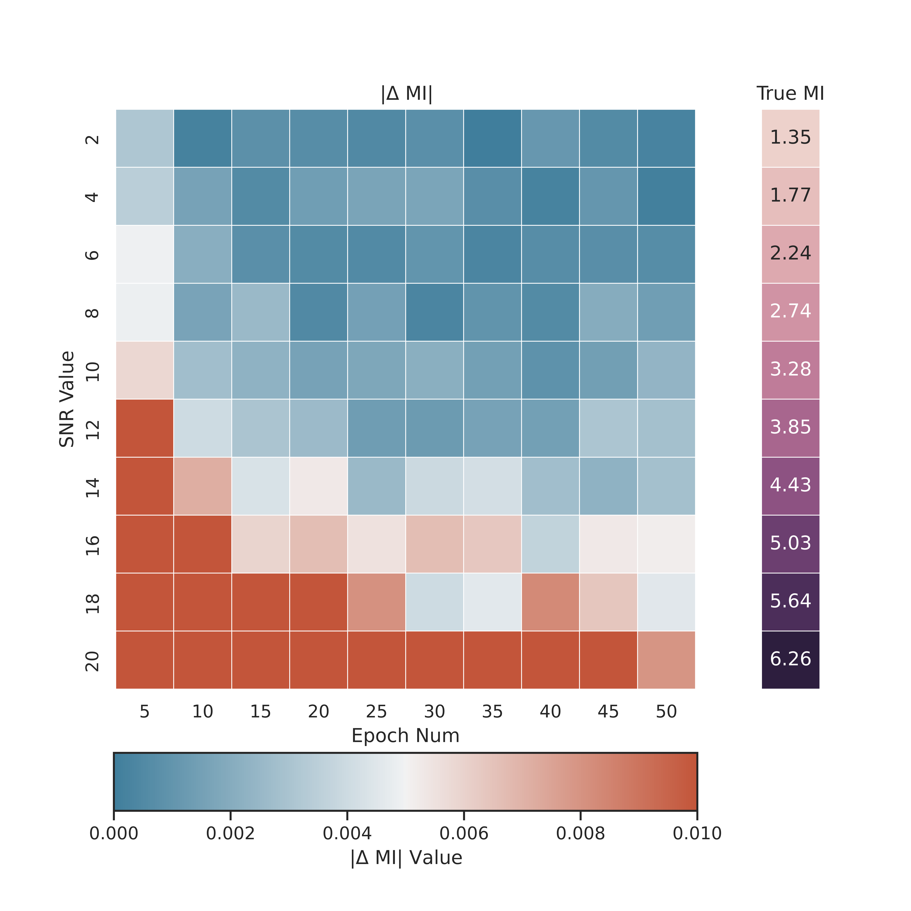
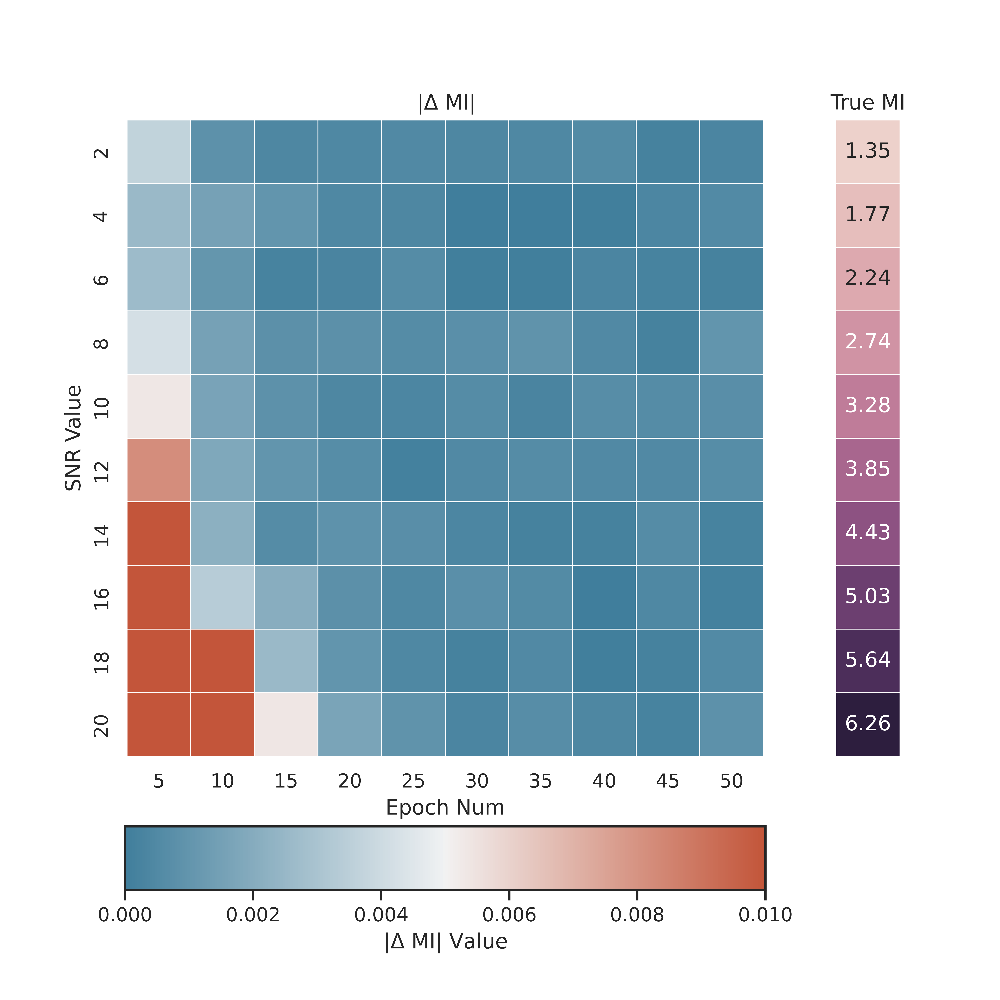

# E-MINE: Enhanced Mutual Information Neural Estimator

## Introduction

Mutual information (MI) is a critical performance metric for the design of optical fiber communication systems, known as an achievable information rate (AIR), quantifying the number of information bits that can be reliably transmitted through a channel. Accurate computation of MI is essential for optical fiber communication system design, optimization, and management.

The data-driven methods utilized the neural network (NN) have been proposed to the realm of deep learning for self-supervised learning. Specifically, [mutual information neural estimation (MINE)](https://arxiv.org/pdf/1801.04062.pdf), employing the Donsker-Varadhan (DV) dual representation, has been proposed for training generative adversarial models and applied in representation learning.  A reasonable deduction is that MINE can give an accurate MI estimation of the optical fiber channel using a data-driven approach, eliminating the need for an analytical channel model. However, the estimation accuracy hinges on both joint and marginal estimations.The sampling matrix composed of joint distribution and marginal distribution occupies N^2 space. Due to computational limitations, the size of the matrix limits the estimation accuracy.In fact, the majority of samples are derived from the marginal distribution, creating an imbalance between joint and marginal training. Therefore, to circumvent this and enhance effective training, we separate the loss function of MINE into two components, each accommodating different batch sizes, namely E-MINE:

$$
Loss_{E-MINE} =\left ( \frac{1}{N}  \sum_{i}T_{\theta }(x^{i} ,y^{i}) -log\frac{1}{M(M-1)} \sum_{i} e^{T_{\theta }( \bar{x}^{i} ,\bar{y}^{i}) }  \right ) 
$$

## Implementation
E-MINE relies on a statistics network T which takes as input two variables X, Y and estimates the mutual information MI(X,Y).The implementation of E-MINE can be found in the provided emine.py code, which can be run directly.

The structure of proposed enhanced mutual information neural estimator is:
```python
    self.forward_pass = nn.Sequential(
            nn.Linear(4, 128),
            nn.ELU(),
            nn.Linear(128, 128),
            nn.ELU(),
            nn.Linear(128, 128),
            nn.ELU(),
            nn.Linear(128, 1))
```

In addition, input data needs to be processed to obtain joint distribution and marginal distribution of the data, calculating the loss function mentioned above:
```python
    def joint_matrix(self,  x, y):
            joint = torch.cat((x,y), dim=-1)
            return self.forward_pass(joint).mean()

    def marginal_matrix(self, x, y):
        x_tiled = torch.stack([x] * batch_size_m, dim=0)
        y_tiled = torch.stack([y] * batch_size_m, dim=1)
        xy_pairs = torch.reshape(torch.cat((x_tiled, y_tiled), dim=2), [batch_size_m * batch_size_m, -1])
        output = self.forward_pass(xy_pairs)
        output = torch.reshape(output, [batch_size_m, batch_size_m]).t()
        infs = torch.tensor([float('inf')] * batch_size_m).to(output.device)
        marginal = torch.logsumexp(output - infs.diag(), dim = (0, 1)) \
            - torch.log(torch.tensor(batch_size_m * (batch_size_m -1 ))).to(device) 
        
        if self.ema:
            exp_marginal = (output - infs.diag()).exp().sum() / batch_size_m / (batch_size_m - 1)
            self.ema = exp_marginal.detach() if self.ema is None else \
                    self.carry_rate * self.ema + \
                    (1 - self.carry_rate) * exp_marginal.detach()
        return marginal
```

## Results
We perform mutual information estimation on data under different SNRs in AWGN channels and compare it with the results obtained using the Gaussian-Hermitian method (which provides theoretical mutual information values).The results indicate that compared to the original training methods, E-MINE can provide a more accurate and stable mutual information estimation.



<center><p>Fig.1 the original training results</p></center>


<center><p>Fig.2 the training results using E-MINE</p></center>